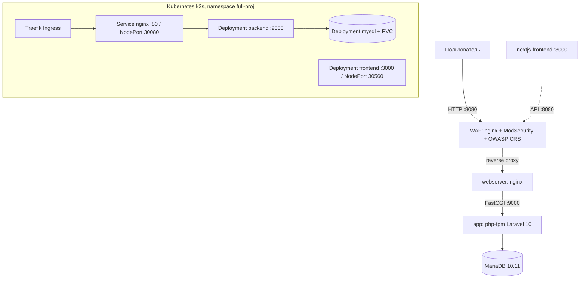

# Документация проекта `full_proj` — индекс спецификаций

Документация ведётся в подходе **spec-driven development**: каждый раздел технического
задания (кейс «MTC ENGINEER HACK», DevOps) отражён в отдельной спецификации
«требования → критерии приёмки → проектные решения → реализация → верификация».
Спецификации — источник истины о том, **что** реализовано, **как** это проверить
и **что** ещё предстоит сделать.

## Карта спецификаций

| № | Спецификация | Раздел кейса | Статус |
|---|---|---|---|
| 01 | [Kubernetes-окружение](specs/01-kubernetes.md) | п.1 | ✅ реализовано (k3s + manifests + Helm) |
| 02 | [Демонстрационное веб-приложение](specs/02-application.md) | п.2 | ✅ реализовано |
| 03 | [Gateway API](specs/03-gateway-api.md) | п.3 | ❌ не реализовано (сейчас Traefik Ingress) |
| 04 | [Мониторинг (Prometheus)](specs/04-monitoring.md) | п.4 | ❌ не реализовано (роадмап) |
| 05 | [Логирование (Fluentd/Filebeat)](specs/05-logging.md) | п.5 | ⚠️ частично (логи есть, сборки нет) |
| 06 | [WAF ModSecurity + OWASP CRS](specs/06-waf.md) | доп. улучшение | ✅ реализовано |
| 07 | [Автоматизация развёртывания](specs/07-automation.md) | п.7 | ✅ реализовано |
| 08 | [Безопасность и секреты](specs/08-security.md) | требования безопасности | ✅ реализовано |
| 09 | [Перенос на новый GitHub](specs/09-migration.md) | подготовка к сдаче | ✅ подготовлено |

Полная детальная спецификация WAF — [`waf/SPEC.md`](../waf/SPEC.md).

## Архитектура

Два контура развёртывания:

1. **Docker Compose** (разработка/демонстрация): `waf` — единственная точка входа на бэкенд
   (порт `webserver` не публикуется), `frontend` — на `:3000`.
2. **Kubernetes** (стенд, Ubuntu 24.04): k3s + raw-манифесты (`k8s/`) или Helm-чарт (`helm/`),
   доступ через Traefik Ingress / NodePort, образы из GHCR, деплой через GitHub Actions.

## Матрица трассируемости требований кейса

| Требование кейса | Статус | Где проверять |
|---|---|---|
| веб-приложение в Kubernetes | ✅ | [SPEC-02](specs/02-application.md), [SPEC-01](specs/01-kubernetes.md) |
| доступ через Kubernetes Gateway API | ❌ роадмап | [SPEC-03](specs/03-gateway-api.md) |
| Prometheus собирает метрики | ❌ роадмап | [SPEC-04](specs/04-monitoring.md) |
| Fluentd/Filebeat собирает логи | ⚠️ роадмап | [SPEC-05](specs/05-logging.md) |
| Ubuntu 24.04 | ✅ | [SPEC-01](specs/01-kubernetes.md), [SPEC-07](specs/07-automation.md) |
| автоматизация, воспроизводимость | ✅ | [SPEC-07](specs/07-automation.md) |
| README + паспорт решения | ✅ | [README](../readme.md), [passport.md](passport.md) |
| нет секретов в репозитории | ✅ | [SPEC-08](specs/08-security.md) |
| дополнительные улучшения | WAF ✅, CI/CD ✅ | [SPEC-06](specs/06-waf.md), [SPEC-07](specs/07-automation.md) |
