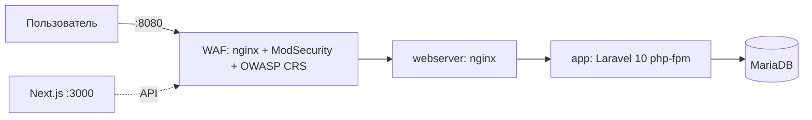

# Паспорт решения — `full_proj`

> Паспорт для быстрого скрининга экспертами (структура по заданию: 3 страницы).
> Подробная документация и спецификации — в репозитории ([`docs/`](README.md)).

---

## Страница 1. Архитектура и состав решения

| Параметр | Значение |
|---|---|
| Версия Kubernetes | k3s v1.28 (Kubernetes v1.28) |
| Способ развёртывания K8s | k3s (`get.k3s.io`), манифесты `k8s/` + Helm-чарт `helm/` |
| Реализация Gateway API | **не используется** (сейчас Traefik Ingress + NodePort); роадмап — Traefik Gateway Provider ([SPEC-03](specs/03-gateway-api.md)) |
| Инструменты автоматизации | `setup.sh` / `setup.ps1`, Docker Compose, Helm, GitHub Actions (self-hosted runner) |
| Логирование | access/error-логи nginx → stdout; Fluentd/Filebeat — роадмап ([SPEC-05](specs/05-logging.md)) |
| Prometheus | не развёрнут — роадмап kube-prometheus-stack ([SPEC-04](specs/04-monitoring.md)) |
| ОС тестирования | Ubuntu 24.04 LTS |
| Доп. улучшения | **WAF ModSecurity + OWASP CRS** (✅ реализован), CI/CD (✅), параметризация секретов (✅) |

### Архитектурная схема

K8s-контур: `Traefik Ingress → Service nginx (NodePort 30080) → backend :9000 → mysql (+PVC)`,
`frontend` — NodePort 30560. Образы собираются CI и публикуются в GHCR.

---

## Страница 2. Реализованный функционал

### Обязательная часть

| Требование кейса | Как реализовано | Обоснование | Как проверить |
|---|---|---|---|
| Веб-приложение в Kubernetes | Deployments backend/frontend/mysql/nginx, PVC, Secret `app-secrets` | стандартные ресурсы, минимальный стек | `kubectl get pods -n full-proj`; `curl <node>:30080/api/news` → 200 JSON |
| Доступ через Gateway API | ❌ не реализовано | — | — |
| Prometheus | ❌ не реализовано | — | — |
| Fluentd/Filebeat | ⚠️ логи nginx в stdout, агент не настроен | — | `kubectl logs -n full-proj deploy/nginx` |
| Ubuntu 24.04 | стенд k3s + runner на Ubuntu 24.04 | требование кейса | развёртывание по инструкции |
| Автоматизация | `./setup.sh` (Compose) / Helm `upgrade --install` / CI | минимум команд, идемпотентность | повторный запуск → состояние не ломается |

### Дополнительные улучшения

| Улучшение | Как реализовано | Обоснование | Как проверить |
|---|---|---|---|
| WAF | `owasp/modsecurity-crs:nginx-alpine` перед nginx; правило 1000001 (сканеры/ботнеты по UA); `limit_req` на статику (L7-DDoS → 429); audit-лог JSON | защита прикладного уровня, точки входа не обойти (порт webserver закрыт) | `./waf/tests/run-tests.sh` → 18/18; `python3 waf/tests/ddos_static.py` → 429; `docker logs modsecurity-waf` |
| CI/CD | GitHub Actions: build → GHCR → helm deploy → rollout waits → debug | воспроизводимый деплой без ручных шагов | push в `main` → успешный run |
| Безопасность секретов | env/Secret/CI-secrets; история очищена от утёкших секретов | требование кейса | `grep -r 'tvhhpbgncugmyrji'` → пусто; gitleaks (роадмап) |

---

## Страница 3. Ревью работы и потенциальное масштабирование

**Главная особенность решения.** Полноценный WAF (ModSecurity + OWASP CRS + собственные
правила) как обязательная точка входа трафика с автоматизированными e2e-тестами и
JSON-аудитом — редкость для учебных работ; вся конфигурация воспроизводима из репозитория.

**Самое сложное решение.** Реализация частотного ограничения (защита от L7-DDoS):
коллекции ModSecurity v3 в образе не персистятся между запросами (проверено
экспериментально), поэтому правило сделано на штатном nginx `limit_req` —
компромисс между «каноничностью» ModSecurity и реальной работоспособностью
(зафиксировано как ADR-4 в `waf/SPEC.md`).

**Предложения по дальнейшему развитию:**

1. Внедрить Gateway API (Traefik Gateway Provider: GatewayClass/Gateway/HTTPRoute) — обязательное требование кейса.
2. Мониторинг: kube-prometheus-stack + nginx-exporter + метрики приложения; Grafana-дашборды.
3. Логирование: fluent-bit DaemonSet → Loki (+ Grafana Explore); вывод логов Laravel в stdout.
4. WAF в K8s-контуре (Deployment перед nginx или sidecar) + TLS (cert-manager).
5. Security-контур: gitleaks в CI, sealed-secrets, NetworkPolicy, RBAC.
6. Телком-специфика: горизонтальное масштабирование (HPA по метрикам), геораспределённость,
   высокая доступность БД (репликация/бэкапы) — потребует внешних систем хранения
   (S3-совместимые, managed-базы) в зависимости от оператора.
