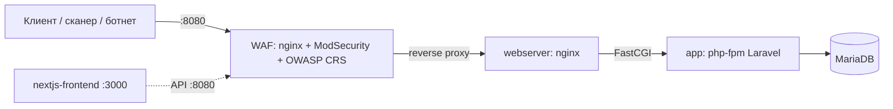

# SPEC — WAF (ModSecurity + OWASP Core Rule Set) для проекта `it_proj`

> Спецификация оформлена в подходе **spec-driven development**:
> требования → критерии приёмки → проектные решения → реализация → верификация (трассируемость).
> Вариант лабораторной работы №4: **вариант 4**.

---

## 0. Мета

| | |
|---|---|
| Проект | `it_proj` — Laravel 10 + Filament CMS + Next.js + MariaDB |
| Дисциплина | БСПИ, лабораторная №4 «Изучение защиты веб-приложений на основе WAF ModSecurity» |
| Вариант | 4 |
| Статус | Реализовано и проверено |
| Компоненты WAF | ModSecurity 3.0.16, ModSecurity-nginx 1.0.4, OWASP CRS 3.3.10, nginx (образ `owasp/modsecurity-crs:nginx-alpine`) |

---

## 1. Контекст и цель

Тестовое веб-приложение (Laravel CMS + Next.js) разворачивается через Docker Compose. Требуется защитить приложение на уровне прикладного протокола HTTP с помощью WAF ModSecurity в связке с Nginx, активировать базовый набор правил OWASP CRS и реализовать специализированные правила варианта 4.

**Цель:** весь внешний HTTP-трафик к бэкенду приложения проходит через WAF, который обнаруживает и блокирует атаки, при этом легитимный трафик не нарушается.

---

## 2. Границы (scope)

**В рамках:**
- Развёртывание тестового приложения (Laravel CMS + БД).
- Развёртывание ModSecurity + Nginx, включение OWASP CRS.
- Пользовательские правила варианта 4 (2 функции).
- Проверка обнаружения/блокировки.

**Вне рамок:**
- Изменение логики самого приложения.
- TLS/сертификаты для продакшена (используется самоподписанный сертификат образа).
- Защита статического фронтенда Next.js на `:3000` (через WAF идёт только его API-трафик на `:8080`).
- Высокодоступная синхронизация состояния WAF между несколькими репликами.

---

## 3. Требования

### 3.1. Функциональные

| ID | Требование | Источник |
|----|-----------|----------|
| **FR-1** | Развернуть тестовое веб-приложение (Laravel CMS + БД + веб-сервер) | Задание, п.1 |
| **FR-2** | Развернуть и настроить WAF ModSecurity в связке с Nginx | Задание, п.2 |
| **FR-3** | Активировать базовый набор правил OWASP Core Rule Set | Задание, п.3 |
| **FR-4** | Пользовательское правило: блокировка запросов от известных сканеров уязвимостей и бот-сетей по характерным шаблонам в заголовке `User-Agent` | Вариант 4 |
| **FR-5** | Пользовательское правило: выявление аномально высокой частоты запросов к статическим ресурсам как признака DDoS-атаки на прикладном уровне | Вариант 4 |
| **FR-6** | Проверить работу системы, убедиться в корректном обнаружении/блокировании атак | Задание, п.5 |

### 3.2. Нефункциональные

| ID | Требование |
|----|-----------|
| **NFR-1** | Легитимный трафик (браузеры, `curl`, JSON API) не блокируется — нулевые ложные срабатывания на тест-наборе |
| **NFR-2** | Решение воспроизводимо: конфигурация хранится в репозитории, запускается одной командой |
| **NFR-3** | Атаки логируются (audit-лог) с указанием ID сработавшего правила |
| **NFR-4** | Правила и параметры вынесены из образов в монтируемые файлы (иначе — «магия», нечитаемая в отчёте) |

---

## 4. Архитектура



- **`waf`** — единственная точка входа для бэкенда, слушает `:8080`, реверс-проксирует на `webserver`.
- **`webserver`** — nginx, отдаёт Laravel (`/var/www/html/public`) и проксирует PHP-FPM. Хост-порт **убран**, чтобы трафик не мог обойти WAF.
- **`app`** — Laravel 10 (php-fpm).
- **`db`** — MariaDB 10.11.
- **`frontend`** — Next.js; его серверные/клиентские вызовы API идут на `:8080`, т.е. через WAF.

Поток обработки запроса в WAF: `nginx` → модуль `ModSecurity-nginx` (фаза 1/2 — запрос) →
пользовательские правила `REQUEST-899-CUSTOM-WAF.conf` → OWASP CRS (`crs-setup.conf` + `rules/*.conf`) →
при отсутствии блокировки `limit_req` (для статики) → `proxy_pass` на `webserver`.

---

## 5. Ключевые проектные решения (ADR)

### ADR-1. Использовать образ `owasp/modsecurity-crs:nginx-alpine`
Готовый образ с уже собранными ModSecurity v3 + ModSecurity-nginx + CRS. Позволяет не собирать
модуль из исходников и гарантирует согласованность версий. Пользовательская конфигурация
монтируется поверх шаблонов образа.

### ADR-2. WAF как реверс-прокси перед `webserver`, а не правка конфига `webserver`
Меньше риска нарушить работу приложения; WAF становится обязательной точкой входа
(порт `webserver` не публикуется). Конфигурация приложения не меняется.

### ADR-3. Пользовательские правила загружаются **до** CRS
Файл назван `REQUEST-899-CUSTOM-WAF.conf` (сортируется раньше `REQUEST-901...`), поэтому наши
блокировки выполняются и логируются раньше правил CRS — это наглядно при разборе логов.
Правила самодостаточны (задают `phase`, `deny`, `status`, `log` явно).

### ADR-4. FR-5 (частота запросов к статике) реализован на уровне nginx (`limit_req`), а не коллекциями ModSecurity
Сначала был реализован «канонический» вариант на коллекциях ModSecurity
(`initcol:ip` + `setvar:ip.static_hits=+1` + `expirevar` + `@gt`). **Он не работает** в этой связке:
ModSecurity v3 в образе **не сохраняет коллекции между запросами** — при включённом debug-логе
каждый запрос заново инициализирует коллекцию значением 1, каталог `SecDataDir`
(`/tmp/modsecurity/data`) остаётся пустым даже после перезагрузки воркеров, а простой счётчик
без `expirevar` также не накапливается (проверено и с 8 воркерами, и с 1).

Поэтому FR-5 реализован штатным механизмом nginx **`limit_req`** с зоной в разделяемой памяти
(`limit_req_zone`), которая корректно работает между воркерами и является стандартным средством
защиты от L7-DoS на уровне WAF-прослойки. Это осознанный компромисс: правило частотного
ограничения относится к слою WAF (nginx), а сигнатурная блокировка (FR-4) — к слою ModSecurity.

---

## 6. Реализация

### 6.1. Файлы

| Файл | Назначение | Монтируется в контейнер как |
|------|-----------|------------------------------|
| `docker-compose.yml` | сервис `waf`, публикация `:8080`, переменные окружения ModSecurity/CRS | — |
| `waf/rules/custom-waf.conf` | пользовательское правило блокировки сканеров/ботнетов (FR-4) | `/opt/owasp-crs/rules/REQUEST-899-CUSTOM-WAF.conf` |
| `waf/rules/scanners-botnets.data` | список шаблонов `User-Agent` (сканируемые подстроки) | `/opt/owasp-crs/rules/scanners-botnets.data` |
| `waf/nginx/default.conf.template` | пользовательское правило частотного лимита статики (FR-5) | `/etc/nginx/templates/conf.d/default.conf.template` |
| `waf/tests/run-tests.sh` | батарея проверок FR-3, FR-4, NFR-1 | — |
| `waf/tests/ddos_static.py` | нагрузочный генератор для проверки FR-5 | — |
| `waf/tests/demo.sh` | наглядная демонстрация (4 сценария + строки audit-лога) | — |

### 6.2. Параметры ModSecurity / CRS (env в compose)

```
MODSEC_RULE_ENGINE=On            # блокирующий режим
PARANOIA=1  DETECTION_PARANOIA=1  BLOCKING_PARANOIA=1     # уровень паранойи CRS
ANOMALY_INBOUND=5  ANOMALY_OUTBOUND=4                     # пороги аномалий
MODSEC_AUDIT_ENGINE=RelevantOnly
MODSEC_AUDIT_LOG=/dev/stdout     # JSON audit в docker logs
```

### 6.3. FR-4 — правило `1000001` (ModSecurity)

```apache
SecRule REQUEST_HEADERS:User-Agent "@pmFromFile /opt/owasp-crs/rules/scanners-botnets.data" \
    "id:1000001, phase:1, t:lowercase, deny, status:403, log, \
     msg:'Blocked: known vulnerability scanner / botnet User-Agent', severity:'CRITICAL', ..."
```

Шаблоны (в `scanners-botnets.data`, регистронезависимо): `sqlmap`, `nikto`, `nmap`,
`masscan`, `zmap`, `zgrab`, `zmeu`, `morfeus`, `w3af`, `wpscan`, `joomscan`, `dirbuster`,
`gobuster`, `feroxbuster`, `wfuzz`, `ffuf`, `nuclei`, `xray`, `openvas`, `nessus`,
`acunetix`, `netsparker`, `qualys`, сервисы интернет-сканирования (`shodan`, `censysinspect`,
`internetmeasurement`, `netsystemsresearch`, `paloalto`), а также маркеры ботнетов
(`mirai`, `hakai`, `tsunami`, `kaiten`, `gafgyt`, `bashlite`, `qbot`, `brickerbot` и др.).
Библиотеки общего назначения (`python-requests`, `python-urllib`, `libwww-perl`,
`go-http-client`) в файл включены по умолчанию закомментированными — из-за риска ложных
срабатываний на легитимных клиентов.

### 6.4. FR-5 — правило частотного лимита (nginx `limit_req`)

```nginx
# http-контекст
limit_req_zone $binary_remote_addr zone=static_per_ip:10m rate=30r/s;

# server/location-контекст для статических расширений
location ~* \.(?:css|js|mjs|map|png|jpe?g|gif|svg|webp|avif|ico|bmp|woff2?|ttf|eot|otf|mp4|webm|ogg|mp3|pdf)$ {
    limit_req zone=static_per_ip burst=60 nodelay;
    limit_req_status 429;      # Too Many Requests
    limit_req_log_level warn;
    include includes/proxy_backend.conf;
}
```

Порог: в среднем **30 запросов/с на IP**, всплеск до **60**. При превышении — **HTTP 429**.

---

## 7. Критерии приёмки

| ID | Дано (Given) | Когда (When) | Тогда (Then) | Требование |
|----|--------------|--------------|--------------|-----------|
| AC-1 | Поднят стек | `GET /` браузерным UA | `200` | NFR-1 |
| AC-2 | Поднят стек | `GET /` с UA сканера (`sqlmap` и т.п.) | `403`, в логе сработало правило `1000001` | FR-4 |
| AC-3 | Поднят стек | `GET /?id=1' OR '1'='1` | `403`, сработали правила CRS (`942100`+`949110`) | FR-3 |
| AC-4 | Поднят стек | `GET /?q=<script>alert(1)</script>` | `403`, сработали правила CRS (`941xxx`+`949110`) | FR-3 |
| AC-5 | Поднят стек | Массовые запросы к статике с одного IP | Часть ответов `429` | FR-5 |
| AC-6 | Поднят стек | `GET /api/news` | `200` + JSON | FR-1 |

---

## 8. Верификация (фактические результаты)

Проверка выполнена на живом стеке (`docker compose up -d db app webserver waf`).

### 8.1. Батарея `waf/tests/run-tests.sh`

```
Summary: 18 passed, 0 failed
```

- Легитимный трафик: Chrome/Firefox/curl → `200`; статика (`/favicon.ico`) → `200`; `GET /api/news` → `200`.
- FR-4: 9 различных UA сканеров → `403`.
- FR-3: SQLi / XSS / path traversal / command injection → `403`.

Подтверждение из audit-лога (JSON в `docker logs modsecurity-waf`):
```
GET /?id=1' OR '1'='1        -> 403  rule 942100 (SQLi via libinjection) + 949110 (anomaly score 5)
GET /?q=<script>alert(1)</scr> -> 403  rules 941100/941110/941160 + 949110 (anomaly score 15)
GET /                        -> 403  rule 1000001 (scanner/botnet User-Agent)
```

### 8.2. `waf/tests/ddos_static.py` (FR-5)

```
python3 waf/tests/ddos_static.py   # 500 запросов, 50 воркеров
Result summary (HTTP status -> count):
   200    101
   429    399
[PASS] WAF rate-limited the source IP: 399 requests answered with 429.
```

### 8.3. Матрица трассируемости

| Требование | Реализация | Проверка | Итог |
|------------|-----------|----------|------|
| FR-1 | сервисы `app`, `db`, `webserver`, `frontend` | `GET /api/news` → 200 | ✅ |
| FR-2 | сервис `waf` + `waf/nginx/default.conf.template` | `nginx -t` OK, `GET /` → 200 | ✅ |
| FR-3 | образ `owasp/modsecurity-crs`, `MODSEC_RULE_ENGINE=On` | AC-3, AC-4 | ✅ |
| FR-4 | правило `1000001` + `scanners-botnets.data` | 9 UA → 403 | ✅ |
| FR-5 | `limit_req zone=static_per_ip` | 399 из 500 → 429 | ✅ |
| FR-6 | `run-tests.sh`, `ddos_static.py` | 18/18 + DDoS | ✅ |
| NFR-1 | правила без ложных срабатываний | AC-1, AC-6 | ✅ |
| NFR-2 | вся конфигурация в репозитории | `docker compose up -d` | ✅ |
| NFR-3 | `MODSEC_AUDIT_LOG=/dev/stdout` (JSON) | ID правил в логе | ✅ |
| NFR-4 | конфиги в `waf/`, монтируются | см. раздел 6.1 | ✅ |

---

## 9. Известные ограничения

1. **ModSecurity-коллекции не персистятся** в данной связке (см. ADR-4) — правила частотного
   ограничения на коллекциях ModSecurity использовать нельзя. Обходной путь — `limit_req` nginx.
2. **Ложные срабатывания при первом запуске** возможны на нестандартные клиенты; шаблоны в
   `scanners-botnets.data` при необходимости расширяются/сужаются.
3. При правке `scanners-botnets.data` (это `@pmFromFile`) нужно перезагрузить конфигурацию nginx
   (`docker exec modsecurity-waf nginx -s reload`) либо перезапустить контейнер `waf`, чтобы список
   шаблонов был перечитан.
4. Для реальной настройки порогов (`rate`, `burst`, пороги аномалий) нужен профиль фактического
   трафика; в лабораторных целях значения подобраны под демонстрацию.

---

## 10. Воспроизведение

```bash
cd it_proj

# 1. Поднять стек (WAF обязателен как точка входа)
docker compose up -d db app webserver waf

# 2. Инициализировать приложение (один раз)
docker compose exec -T app php artisan migrate --force
docker compose exec -T app php artisan db:seed --force

# 3. Проверка
./waf/tests/demo.sh                    # наглядная демонстрация
./waf/tests/run-tests.sh               # FR-3, FR-4, NFR-1  -> 18/18
python3 waf/tests/ddos_static.py       # FR-5              -> 429

# Диагностика
docker logs -f modsecurity-waf           # audit-лог (JSON) с ID правил
```

Переключение в режим только-обнаружения (без блокировки):
`MODSEC_RULE_ENGINE: "DetectionOnly"` в `docker-compose.yml`, затем `docker compose up -d waf`.

---

## 11. Ссылки

- OWASP Core Rule Set — https://coreruleset.org/
- ModSecurity — https://github.com/owasp-modsecurity/ModSecurity
- Образ — https://github.com/owasp-modsecurity/ModSecurity-crs-docker
- Nginx `limit_req` — https://nginx.org/en/docs/http/ngx_http_limit_req_module.html
